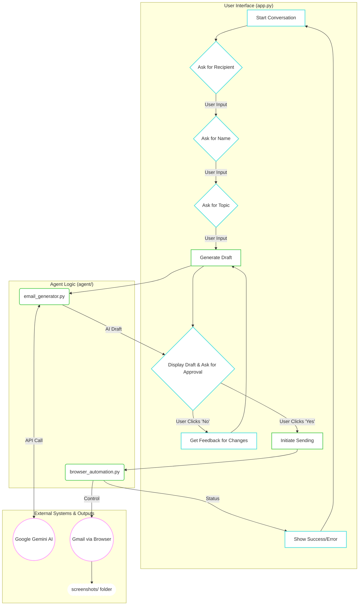

# Autonomous Email Assistant

A smart desktop application that provides a conversational chat interface for users to generate and automatically send professional emails using AI and browser automation.

## Project Overview & Key Features

This project brings together cutting-edge AI and automation to create a truly helpful email assistant. Instead of filling out forms, you can interact with the agent through a natural, conversational chat interface. The agent is designed to understand your intent, ask for the absolute minimum information required, and then take over the entire process of writing and sending the email.

* **Natural Conversation Flow:** The agent doesn't use forms. It engages in a flowing conversation, asking for one piece of information at a time (like the recipient or topic) to feel like you're talking to a real assistant.
* **Intelligent AI Content Generation:** Powered by the Google Gemini API, the agent doesn't just fill in templates. It understands the intent behind your request and generates a complete, professional, and context-aware email draft from scratch. It is explicitly programmed to never use placeholders.
* **Live Visual Feedback:** The agent shows you what it's doing. When it's time to send the email, it launches a visible browser window, allowing you to watch the entire process in real-time as it logs in, composes the message, and clicks send.
* **Step-by-Step Screenshotting:** For a complete audit trail, the agent automatically captures and saves screenshots at every critical step of the browser automation process, from the login page to the final "message sent" confirmation.
* **Robust Authentication & Captcha Handling:** The system is designed to handle modern web security. By launching a visible browser. This "human-in-the-loop" approach is a reliable solution for complex login challenges.

---

* [Architecture Overview](#️-architecture-overview)
* [Technology Stack & Justification](#-technology-stack--justification)
* [Setup and Running Instructions](#-setup-and-running-instructions)
* [Challenges Faced & Solutions Implemented](#-challenges-faced--solutions-implemented)

---

## Architecture Overview

The application is built on a decoupled, three-part architecture to ensure stability and responsiveness. The **User Interface (UI)** is completely separate from the **AI "brain"** and the **browser "hands,"** which prevents the application from freezing during complex operations.

### Architecture Diagram (Mermaid)



(continued in the next cell for character limit)

---

## Detailed File Explanation

### `app.py` - The Application Core & UI

- **Role**: This is the main entry point and the user-facing part of the application. It creates the modern, attractive chat window using the CustomTkinter library.
- **Conversational Flow**: It manages a precise **State Machine (self.conversation_state)** that guarantees a minimal, non-irritating conversation. It asks for the recipient, then the user's name, and finally the email topic.
- **Responsiveness**: To prevent the UI from ever freezing, all heavy operations are run in the background using Python's threading module. When the AI is thinking or the browser is running, the main UI thread remains completely responsive.
- **The Feedback Loop**: This is a critical feature managed by app.py. After a draft is generated and displayed in a dedicated panel, **the user is presented with "Yes, Send It" and "No, I need changes" buttons.** If the user clicks **"No," a pop-up dialog appears to collect feedback.** This feedback is then used to re-run the generation process, ensuring the user has final control over the content.

### `agent/email_generator.py` - The AI Brain

- **Role**: This module's sole responsibility is to generate a complete, professional, and ready-to-send email draft. It acts as the creative core of the assistant.
- **AI Model**: It interfaces with the **Google Gemini API**, specifically using the** gemini-1.5-flash-latest model.** This model was chosen for its optimal balance of speed and reasoning power, allowing for quick draft generation without sacrificing quality.
- **Intent-Based Generation**: The core of this file is the advanced prompt sent to the AI. This prompt contains a strict set of rules that command the AI to **"get the intent"** of the user's request and write a full email. It is explicitly forbidden from using placeholders or inventing fake personal details.
- **Output**: It returns a clean JSON object ({"subject": "...", "body": "..."}) that the main app.py can easily parse and display.
- 
### `agent/browser_automation.py` - The Automation Hands

- **Role**: This module acts as the "hands" of the assistant, performing the final action of sending the email.
- **Real-Time View**:  It uses the **Playwright(Browser-Use Library. It is perfecas it is built specifically for LLM-powered browser automation)** framework to launch a visible browser by setting headless=False. This provides the **"real-time see"** feature, allowing the user to watch the entire automation process live.
- **Screenshot Feature**: At every key step of the automation, a page.screenshot() command is executed. This saves a numbered image to the screenshots/ folder, creating a valuable visual log of the agent's actions.
- **Robust Element Selection**: This module solves the critical challenge of the agent getting confused on the Gmail page. By using Playwright's modern selectors like page.get_by_role("textbox", name="Enter your password"), it can reliably distinguish between similar-looking elements.
- **Captcha Handling/Google Security during Login**: The visible browser is the solution for handling Google's security checks. Sometimes, Google detects the automated browser operating so after the entered email and on the password page the agent sees two password field one is the original visible one and the another is hidden which is not visible, but the agent handles it as it is the security feature by google due to which many agents fails into login. But this can login succesfully. **NOTE: I have turned off the 2FA. For **2FA(Two-Factor Authentication)**, the recommended solution is to generate an "App Password" from the Google Account settings and use that in the .env file instead of the regular account password. This is more secure and often bypasses standard 2FA prompts for trusted applications.**
---

## Technology Stack & Justification
Each technology in this project was chosen for a specific reason to maximize performance, stability, and user experience.

- **Python**: The core programming language, chosen for its simplicity, extensive libraries, and strong support for AI and automation. It's the industry standard for this type of work.
- **CustomTkinter**:Used for the graphical user interface (GUI). It was chosen over standard Tkinter for its modern, attractive appearance and over web frameworks like Flask/Streamlit to create a stable, single-process desktop application. This was a critical decision that completely eliminated the complex NotImplementedError we encountered with web-based solutions.
- **Google Generative AI (google-generativeai)**:
  - **Role**: This is the official Python library from Google that acts as the bridge to the Gemini family of AI models. It handles authenticating with your API key and sending our carefully crafted prompts to Google's servers.
  - **Justification**: We use this library to access the gemini-1.5-flash-latest model. It uses **GEMINI_API_KEY** for composing and generating email and uses its API Key. It uses Gemini latest model. "Flash" was specifically chosen for its excellent balance of high speed and powerful reasoning. This is crucial for a responsive chat application where users expect quick replies.
- **Playwright(Browser-use Library)**: The **browser automation framework**. It was chosen over alternatives like Selenium for its modern, robust API that is better at handling dynamic, complex web applications like Gmail. Its get_by_role and get_by_placeholder selectors proved essential for reliably finding elements on the page, which was a major challenge.
- **Regular Expressions (`re`)**:
  - **Role**: This standard Python library is a powerful tool for pattern matching in text.
  - **Justification**: The Gemini AI, while instructed to return clean JSON, would sometimes add extra text or formatting. The re.search(r'\{.*\}', ...) command in email_generator.py is a bulletproof solution that finds the JSON object ({...}) within the AI's response, no matter what extra text surrounds it.
- **Dotenv**:
  - Used for securely managing credentials. This is a best-practice approach that keeps your sensitive information (like email passwords and API keys) out of the main source code.

---

## Setup and Running Instructions

### Prerequisites

- Python 3.8+
- Terminal or Command Line Access

### Step 1: Clone or Download the Project

Ensure the following structure:

```
Email-assistant/
│
├── agent/
│   ├── __init__.py
│   ├── browser_automation.py
│   └── email_generator.py
├── screenshots/
│   ├── 01_login_page.png
│   ├── 02_email_entered.png
│   ├── 03_password_entered.png
│   ├── 04_inbox_loaded.png
│   ├── 05_email_composed.png
│   └── 06_email_sent.png
├── app.py
├── .env
└── requirements.txt
```

### Step 2: Set Up a Virtual Environment

```bash
python -m venv venv
# On Windows:
venv\Scripts\activate
# On macOS/Linux:
source venv/bin/activate
```

### Step 3: Install Dependencies

```bash
pip install customtkinter google-generativeai playwright python-dotenv
```

### Step 4: Install Playwright Browsers

```bash
playwright install
```

### Step 5: Configure Your Credentials

Create a `.env` file in the root directory:

```env
GEMINI_API_KEY="YOUR_GEMINI_API_KEY"
GMAIL_ADDRESS="your-test-email@gmail.com"
GMAIL_PASSWORD="your-test-email-password"
```

> **Use a test Gmail account** to avoid any personal security issues.

### Step 6: Run the Application

```bash
python app.py
```

A chat-based desktop window will appear and is ready to use.

---

## Challenges Faced & Solutions Implemented

### Challenge 1: UI Instability and Freezing

- **Problem**: Initial attempts using both web frameworks (Flask/Streamlit) and early desktop versions caused the application to either crash with a NotImplementedError or freeze completely during long-running tasks.
- **Solution**: We adopted a two-part solution. First, we committed to a native desktop application using CustomTkinter to eliminate the event-loop conflicts. Second, we implemented Python's threading module to run all heavy tasks in a background thread, ensuring the UI remains active and responsive at all times.

### Challenge 2: AI Generating Incomplete Content or unhelpful content

- **Problem**: The AI model would often return drafts with placeholders like [add your details here] or invent unrealistic personal information (like fake colleague names), defeating the purpose of the automation.
- **Solution**: This was solved through advanced prompt engineering. The final prompt in agent/email_generator.py gives the AI a strict set of unbreakable rules: it is forbidden from using placeholders and forbidden from inventing personal information, but it must invent plausible, non-personal details to make the email complete.

### Challenge 3: Unreliable Browser Automation

- **Problem**: The automation was highly unreliable. The script would frequently fail because it couldn't find the correct element to interact with. Specific issues included:
  - **Password Field**: The script would find two password fields (one hidden, one visible) and crash due to ambiguity.
  - **"To" and "Send" Buttons**: The script would get confused between the main "Send" button and the dropdown arrow for "schedule send."
- **Solution**: We abandoned simple selectors and adopted Playwright's modern "accessible role" locators. Instead of looking for a generic input[type="password"], the final code looks for page.get_by_role("textbox", name="Enter your password"). This is far more specific and reliable and stabilized the automation completely.
  
### Challenge 4: Handling Google Security(Captcha/Security)

- **Problem**: Automated logins are often flagged as suspicious by Google, triggering a Captcha prompt that a simple script cannot solve.
- **Solution**: The final solution embraces a "human-in-the-loop" approach. By setting headless=False in agent/browser_automation.py, the browser is always visible. **NOTE: For **2FA(Two-Factor Authentication)**, the recommended solution is to generate an "App Password" from the Google Account settings and use that in the .env file instead of the regular account password. This is more secure and often bypasses standard 2FA prompts for trusted applications.**

