# Autonomous Email Assistant

A smart desktop application that provides a conversational chat interface for users to generate and automatically send professional emails using AI and browser automation.

## Table of Contents
- Architecture Overview
- Technology Stack & Justification
- Setup and Running Instructions
- Challenges Faced & Solutions Implemented

## Architecture Overview
The application is built on a decoupled, three-part architecture to ensure stability and responsiveness. The User Interface (UI) is completely separate from the AI "brain" and the browser "hands," which prevents the application from freezing during complex operations.

### Architecture Diagram (Mermaid)

```mermaid
graph TD
    subgraph "User Interface (app.py)"
        A[Start Conversation] --> B{Ask for Recipient};
        B -->|User Input| C{Ask for Name};
        C -->|User Input| D{Ask for Topic};
        D -->|User Input| E[Generate Draft];
        E --> F{Display Draft & Ask for Approval};
        F -->|User Clicks 'No'| G[Get Feedback for Changes];
        G --> E;
        F -->|User Clicks 'Yes'| H[Initiate Sending];
        I[Show Success/Error] --> A;
    end

    subgraph "Agent Logic (agent/)"
        E --> J(email_generator.py);
        J -->|AI Draft| F;
        H --> K(browser_automation.py);
        K -->|Status| I;
    end

    subgraph "External Systems & Outputs"
        J <-->|API Call| L((Google Gemini AI));
        K -->|Control| M((Gmail via Browser));
        M --> N([screenshots/ folder]);
    end

    style A fill:#2D2D2D,stroke:#4ADEDE,stroke-width:2px
    style B fill:#2D2D2D,stroke:#4ADEDE,stroke-width:2px
    style C fill:#2D2D2D,stroke:#4ADEDE,stroke-width:2px
    style D fill:#2D2D2D,stroke:#4ADEDE,stroke-width:2px
    style E fill:#333,stroke:#5C5,stroke-width:2px
    style F fill:#2D2D2D,stroke:#4ADEDE,stroke-width:2px
    style G fill:#2D2D2D,stroke:#4ADEDE,stroke-width:2px
    style H fill:#333,stroke:#5C5,stroke-width:2px
    style I fill:#2D2D2D,stroke:#4ADEDE,stroke-width:2px
    style J fill:#333,stroke:#5C5,stroke-width:2px
    style K fill:#333,stroke:#5C5,stroke-width:2px
    style L fill:#333,stroke:#f9f,stroke-width:2px
    style M fill:#333,stroke:#f9f,stroke-width:2px
    style N fill:#888,stroke:#fff,stroke-width:2px,stroke-dasharray: 5 5
```


## Detailed File Explanation

### app.py - The Application Core & UI

- **Role**: This is the main entry point and the user-facing part of the application. It creates the modern, attractive chat window using the CustomTkinter library.
- **Conversational Flow**: It manages a precise State Machine (self.conversation_state) that guarantees a minimal, non-irritating conversation. It asks for the recipient, then the user's name, and finally the email topic. It does not ask any other questions unless the user requests changes.
- **Responsiveness**: To prevent the UI from ever freezing, all heavy operations are run in the background using Python's threading module. When the AI is thinking or the browser is running, the main UI thread remains completely responsive.
- **The Feedback Loop**: This is a critical feature managed by app.py. After a draft is generated and displayed in a dedicated panel, the user is presented with "Yes, Send It" and "No, I need changes" buttons. If the user clicks "No," a pop-up dialog appears to collect feedback. This feedback is then used to re-run the generation process, ensuring the user has final control over the content.

### agent/email_generator.py - The AI Brain

- **Role**: This module's sole responsibility is to generate a complete, professional, and ready-to-send email draft. It acts as the creative core of the assistant.
- **AI Model**: It interfaces with the Google Gemini API, specifically using the gemini-1.5-flash-latest model. This model was chosen for its optimal balance of speed and reasoning power, allowing for quick draft generation without sacrificing quality. This uses Gemini for generating email and connects it through GEMINI_API_KEY. This is the latest model of Gemini.
- **Intent-Based Generation**: The core of this file is the advanced prompt sent to the AI. This prompt contains a strict set of rules that command the AI to "get the intent" of the user's request and write a full email. It is explicitly forbidden from using placeholders like [...] or inventing fake personal details (names, contact info), which was a key challenge we solved. It must, however, invent plausible non-personal details to make the email sound authentic.
- **Output**: It returns a clean JSON object ({"subject": "...", "body": "..."}) that the main app.py can easily parse and display.

### agent/browser_automation.py - The Automation Hands

- **Role**: This module acts as the "hands" of the assistant, performing the final action of sending the email.
- **Real-Time View**: It uses the Playwright(Browser-Use Library: It is perfect as it is built specifically for LLM-powered browser automation.) framework to launch a visible browser by setting headless=False. This is the solution that provides the "real-time see" feature, allowing the user to watch the entire automation process live on their screen.
- **Screenshot Feature**: At every key step of the automation (navigating to the login page, entering the email, entering the password, composing the email, etc.), a page.screenshot() command is executed. This saves a numbered image to the screenshots/ folder, creating a valuable visual log and audit trail of the agent's actions.
- **Robust Element Selection**: This module solves the critical challenge of the agent getting confused on the Gmail page. By using Playwright's modern selectors like page.get_by_role("textbox", name="Enter your password"), it can reliably distinguish between similar-looking elements (like the main "Send" button and its dropdown arrow), making the automation stable.
- **Captcha**: The visible browser (headless=False) is also the solution for handling Google's security checks. Sometimes, Google detects the browser automation so after the login page on the password page there are two fields to enter password one is the email_password and another is the security feature by Google which is hidden and not visible, it is like Captcha, so many scripts fails there in browser_automation and can not login the gmail. It handles it properly.

## Technology Stack & Justification

Each technology in this project was chosen for a specific reason to maximize performance, stability, and user experience.

- **Python**: The core programming language, chosen for its simplicity, extensive libraries, and strong support for AI and automation. It's the industry standard for this type of work, allowing for rapid development and integration with all our chosen tools.
- **CustomTkinter**: Used for the graphical user interface (GUI). It was chosen over standard Tkinter for its modern, attractive appearance and over web frameworks like Flask/Streamlit to create a stable, single-process desktop application. This was a critical decision that completely eliminated the complex NotImplementedError we encountered with web-based solutions, which arose from conflicts between the web server's and Playwright's asynchronous event loops on Windows.
- **Google Generative AI (google-generativeai library)**:
  - **Role**: This is the official Python library from Google that acts as the bridge to the Gemini family of AI models. It handles the complex work of authenticating with your API key and sending our carefully crafted prompts to Google's servers.
  - **Justification**: We use this library to access the gemini-1.5-flash-latest model.  This uses Gemini for generating email and connects it through GEMINI_API_KEY. This is the latest model of Gemini. "Flash" was specifically chosen for its excellent balance of high speed and powerful reasoning. This is crucial for a responsive chat application where users expect quick replies. It is powerful enough to understand the complex instructions in our prompts while being efficient enough not to cause a noticeable lag during draft generation.
- **Playwright (Browser-Use Library)**: The browser automation framework. It was chosen over alternatives like Selenium for its modern, robust API that is better at handling dynamic, complex web applications like Gmail. It is perfect as it is built specifically for LLM-powered browser automation. Its get_by_role and get_by_placeholder selectors proved essential for reliably finding elements on the page, which was a major challenge. This method of finding elements by their "accessible role" (e.g., "button", "textbox") is more resilient to minor changes in the website's code than older methods that rely on fragile IDs or class names.
- **Regular Expressions (re library)**:
  - **Role**: This standard Python library is a powerful tool for pattern matching in text. In our project, it plays a critical role in making the AI interaction robust.
  - **Justification**: The Gemini AI, while instructed to return clean JSON, would sometimes add extra text or formatting (like markdown's ```json). The re.search(r'\{.*\}', ...) command in email_generator.py is a bulletproof solution that finds the JSON object ({...}) within the AI's response, no matter what extra text surrounds it. This was a key fix that solved the silent "couldn't generate an email" errors.
- **Dotenv**: Used for securely managing credentials. This is a best-practice approach that keeps your sensitive information (like email passwords and API keys) out of the main source code, preventing it from being accidentally committed to a public repository. (.env) this file keeps all secrets things like GEMINI_API_KEY, GMAIL_ADDRESS, GMAIL_PASSWORD. All these things can directly be loaded from it by load_dotenv().

## Setup and Running Instructions

Follow these steps to get the application running on your local machine.

### Prerequisites

- Python 3.8+
- Access to a command line or terminal

### Step 1: Clone or Download the Project

Download the project files and place them in a dedicated folder (e.g., Email-assistant). Ensure you have the final file structure:

```
Email-assistant/
├── agent/
│   ├── __init__.py
│   ├── browser_automation.py
│   └── email_generator.py
├── screenshots/
│   ├── 01_login_page.png
│   ├── 02_email_entered.png
│   ├── 03_password_entered.png
│   ├── 04_inbox_loaded.png
│   ├── 05_email_composed.png
│   └── 06_email_sent.png
├── app.py
└── .env
├── requirements.txt
```

### Step 2: Set Up a Virtual Environment

It is highly recommended to use a virtual environment. Open your terminal in the project folder and run:

```bash
# Create the virtual environment
python -m venv venv

# Activate it
# On Windows:
venv\Scripts\activate
# On macOS/Linux:
source venv/bin/activate
```

### Step 3: Install Dependencies

```bash
pip install customtkinter google-generativeai playwright python-dotenv
```

### Step 4: Install Playwright Browsers

```bash
playwright install
```

### Step 5: Configure Your Credentials

Create a file named .env in the main project directory.

Open the .env file and add your credentials in the following format:

```env
# Replace with your actual credentials
GEMINI_API_KEY="YOUR_GEMINI_API_KEY"
GMAIL_ADDRESS="your-test-email@gmail.com"
GMAIL_PASSWORD="your-test-email-password"
```

**Important:** It is highly recommended to use a new test Gmail account for this to avoid any security issues with your personal account.

### Step 6: Run the Application

```bash
python app.py
```

A desktop window with the chat interface will appear, ready for you to use.

## Challenges Faced & Solutions Implemented

### Challenge 1: UI Instability and Freezing

- **Problem**: Initial attempts using both web frameworks (Flask/Streamlit) and early desktop versions caused the application to either crash with a NotImplementedError or freeze completely during long-running tasks like AI generation and browser automation.
- **Solution**: 
  - We adopted a two-part solution. First, we committed to a native desktop application using CustomTkinter to eliminate the event-loop conflicts. 
  - Second, we implemented Python's threading module to run all heavy tasks in a background thread, ensuring the UI remains active and responsive at all times.

### Challenge 2: The AI Generating Incomplete or Unhelpful Content

- **Problem**: The AI model would often return drafts with placeholders like [add your details here] or invent unrealistic personal information (like fake colleague names), defeating the purpose of the automation.
- **Solution**: 
  - Solved through advanced prompt engineering. 
  - The final prompt in agent/email_generator.py gives the AI a strict set of unbreakable rules: it is forbidden from using placeholders and forbidden from inventing personal information, but it must invent plausible, non-personal details to make the email complete.

### Challenge 3: Fragile and Unreliable Browser Automation

- **Problem**: The automation was highly unreliable. The script would frequently fail because it couldn't find the correct element to interact with. Specific issues included:
  - Password Field: The script would find two password fields (one hidden, one visible) and crash due to ambiguity.
  - "To" and "Send" Buttons: The script would get confused between the main "Send" button and the dropdown arrow for "schedule send," or between the "To" field and other page elements.
- **Solution**: 
  - We abandoned simple selectors and adopted Playwright's modern "accessible role" locators. 
  - This stabilized the automation completely.

### Challenge 4: Handling Google's Security (Captcha and Login password issue)

- **Problem**: Automated logins are often flagged as suspicious by Google, triggering a Captcha prompt that a simple script cannot solve.
- **Solution**: 
  - Final solution embraces a "human-in-the-loop" approach. 
  - By setting headless=False in agent/browser_automation.py, the browser is always visible.
  - For 2FA, the recommended solution is to generate an "App Password" from the Google Account settings and use that in the .env file instead of the regular account password. This is more secure and often bypasses standard 2FA prompts for trusted applications.
